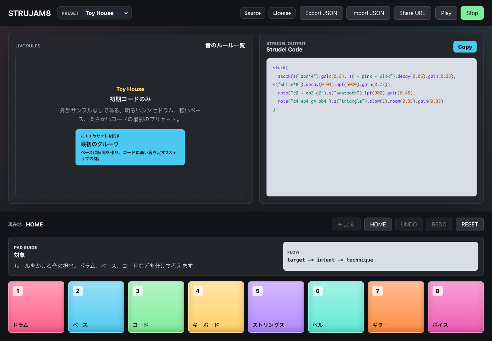
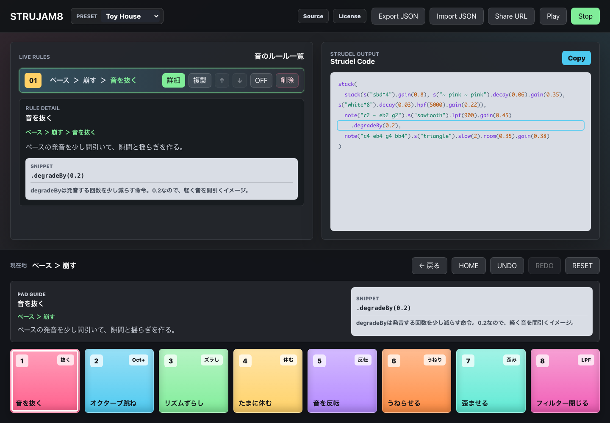

# StruJam8

StruJam8 is an open-source visual jam interface for Strudel.

**音を選んで、動きを選んで、8パッドでジャムる。**

StruJam8は、Strudelのためのオープンソースなビジュアル・ジャムUIです。
8つのパッドで「対象 -> 意図 -> 手法」を選び、音のルールを作りながら演奏できます。
遊んでいるうちにStrudelコードが読めるようになることを目指します。

## Core Concept

- Choose a sound
- Choose an intention
- Choose a technique
- Jam with 8 pads
- Learn Strudel gradually

## Current Status

StruJam8 is currently an MVP focused on UI, state management, generated-code feedback, and a first Strudel audio preview.
Play/Stop can start and stop a conservative `@strudel/web` preview. While playing, changes to the audible code are re-evaluated so the right-side code panel stays aligned with playback. External sample packs are not loaded by default yet.

Implemented:

- 8-pad navigation across three levels: target, intent, technique
- Rule list generated from selected techniques
- Rule ON/OFF toggling, duplication, deletion, reordering, reset, undo, and redo for rule changes
- Beginner starter jam action that adds two safe example rules as one undoable change
- Toy House and Neon Dub preset selection
- Local browser persistence for rules and preset selection
- JSON export/import for jam snapshots
- Shareable URL snapshots for small jams through the Share URL control
- Audible Strudel code display from the same code string used by Play
- Playable snippets include readable route comments immediately above each technique chain
- First Play/Stop audio preview through `@strudel/web`, with live re-evaluation when the audible code changes
- Playback code generation that follows the preset base tracks and skips disabled, missing, and unverified snippets
- Token-colored Strudel-like code with runtime event-location highlighting while playing, including merged highlights for simultaneous tracks, plus a fallback pulse when no location is available
- Copy audible Strudel code to clipboard
- Concrete technique routes covering all eight targets and all eight intents at least once
- Track templates for all eight targets
- Intent-level route guide plus technique preview and rule detail panels with descriptions, snippet explanations, short labels, TODO badges, and playback-safety notes for unverified snippets
- Number-key shortcuts for live pads 1-8, with guards for editable controls
- Visible keyboard focus states
- Named control groups, touch-sized controls, and reduced-motion preference support
- Screen reader status announcements and full-route labels for rule actions, including reset semantics
- Live pad color contrast guarded by tests
- Visible source and license links for release readiness
- Dark interface with colorful live pads
- Responsive layout for desktop and tablet-sized screens
- Recoverable audio failures expose a visible Retry state
- Unexpected UI rendering failures show a reloadable fallback instead of a blank screen
- React Testing Library + jsdom integration coverage for route navigation, reset, persistence restore, number-key navigation, and audio retry recovery
- Playwright browser checks for route navigation, code updates, RESET, starter jam onboarding, safe exclusion of unverified snippets, real invalid-snippet failure recovery, tablet-width overflow, narrow mobile touch controls, browser audio start/stop, and live code highlighting across a representative route for all eight target tracks
- The Strudel audio runtime is lazy-loaded only after Play, with browser checks guarding that initial-load behavior in both development and GitHub Pages production previews

Not implemented yet:

- Editor-level exact `miniLocations` parity and all-route audio/runtime coverage
- External sample-pack loading and sample-license review
- Blockly or visual programming blocks
- Pattern editing
- MIDI or controller input
- Full all-route runtime-highlight coverage remains; representative all-eight-target coverage, safe-exclusion checks, real invalid-snippet failure recovery, audio start/stop, lazy loading, and runtime-load Retry recovery are covered

## Presets

The first preset is **Toy House**. A second static preset, **Neon Dub**, is available from the header selector.

Toy House starts with this base code:

```js
stack(
  stack(s("sbd*4").gain(0.8), s("~ pink ~ pink").decay(0.06).gain(0.35), s("white*8").decay(0.03).hpf(5000).gain(0.22)),
  note("c2 ~ eb2 g2").s("sawtooth").lpf(900).gain(0.45),
  note("c4 eb4 g4 bb4").s("triangle").slow(2).room(0.35).gain(0.38)
)
```

Concrete routes currently include 37 route sets, with at least one concrete route for every target and every intent:

- ドラム -> 踊らせる
- ドラム -> 盛り上げる
- ドラム -> 抜く
- ドラム -> 崩す
- ドラム -> チル
- ドラム -> ランダム感
- ドラム -> 前に出す
- ドラム -> 広げる
- ベース -> 崩す
- ベース -> 踊らせる
- ベース -> 盛り上げる
- ベース -> 抜く
- ベース -> チル
- ベース -> 前に出す
- ベース -> ランダム感
- ベース -> 広げる
- コード -> 盛り上げる
- コード -> チル
- コード -> 広げる
- コード -> 抜く
- コード -> 崩す
- コード -> 前に出す
- コード -> ランダム感
- コード -> 踊らせる
- キーボード -> チル
- キーボード -> ランダム感
- キーボード -> 広げる
- キーボード -> 前に出す
- ストリングス -> 広げる
- ストリングス -> 前に出す
- ベル -> ランダム感
- ベル -> 広げる
- ギター -> 前に出す
- ギター -> 踊らせる
- ボイス -> 前に出す
- ボイス -> 広げる
- ボイス -> ランダム感

When techniques are selected, StruJam8 groups them by track and appends a readable Strudel-like chain:

```js
stack(
  stack(s("sbd*4").gain(0.8), s("~ pink ~ pink").decay(0.06).gain(0.35), s("white*8").decay(0.03).hpf(5000).gain(0.22)),
  note("c2 ~ eb2 g2").s("sawtooth").lpf(900).gain(0.45)
    .degradeBy(0.2)
    .distort(0.4),
  note("c4 eb4 g4 bb4").s("triangle").slow(2).room(0.35).gain(0.38)
)
```

## Tech Stack

- Vite
- React
- TypeScript
- CSS
- Strudel concepts and snippets
- `@strudel/web` for the first browser audio preview

Note: the default presets use built-in synth/noise sounds only. External Strudel sample packs are not loaded by default in this playback phase.

## Development

```bash
npm install
npm run dev
```

Test:

```bash
npm test
npm run test:e2e
npm run test:e2e:pages
```

The first browser test run may require `npx playwright install chromium`.

Build:

```bash
npm run build
```

Quality check:

```bash
npm run check
```

## Deployment

The app is configured for GitHub Pages at:

https://toyo1621.github.io/StruJam8/

The deployment workflow is defined in `.github/workflows/pages.yml`. It runs `npm run check:pages`, uploads `dist/`, and deploys through GitHub Pages. Local development still runs at the Vite root path. See [docs/deployment.md](docs/deployment.md) for the deployment runbook.
See [docs/release-readiness.md](docs/release-readiness.md) for the current functional/non-functional requirement evaluation and release gate.

## Project Structure

```text
.github/
  workflows/ci.yml      GitHub Actions validation workflow
  workflows/pages.yml   GitHub Pages deployment workflow
src/
  App.tsx                Main UI and app state
  App.css                Visual design and responsive layout
  audio/
    strudelEngine.ts      Small Strudel runtime boundary for Play/Stop
  types.ts               Shared TypeScript types
  components/            Focused React UI components
  data/
    pads.ts              Target, intent, and visible pad data
    padColors.ts         Shared live pad palette and contrast target
    presets.ts          Preset metadata and base Strudel-like code
    projectLinks.ts      Source and license links shown in the app
    routes.ts            Concrete target/intent route definitions
    tracks.ts            Track metadata and starter pattern templates
    techniques.ts        Technique definitions and Strudel snippets
  lib/
    announcements.ts   Screen reader announcement formatting
    clipboard.ts       Clipboard copy helpers
    colorContrast.ts    Pad color contrast helpers
    codegen.ts           Audible Strudel code formatting
    codeHighlight.ts      Active target and rule-snippet highlighting
    codeTokens.ts        Syntax-colored Strudel-like code tokenization
    codeLocations.ts     Runtime Strudel event range mapping
    keyboard.ts        Keyboard shortcut helpers
    persistence.ts     Local storage and JSON snapshot helpers
    shareUrl.ts        URL snapshot sharing helpers
  state/
    appReducer.ts        App state transitions and rule actions
docs/
  deployment.md          GitHub Pages deployment runbook
  license-review.md      License decision notes
  technique-design.md    Technique design principles and route expansion guide
```

## Demo Assets





A tablet-width capture is available at [docs/assets/strujam8-tablet.png](docs/assets/strujam8-tablet.png). See [docs/demo.md](docs/demo.md) for the capture flow and remaining GIF plan. See [docs/technique-design.md](docs/technique-design.md) for how technique routes should be designed.

## Contributing

See [CONTRIBUTING.md](CONTRIBUTING.md) for setup, validation, and PR guidelines.

## Notice

This is not an official Strudel project.

## License

StruJam8 is licensed under `AGPL-3.0-or-later`. See [LICENSE](LICENSE).

The current license decision is documented in [docs/license-review.md](docs/license-review.md). Re-check compatibility before loading external sample packs, changing runtime packages, deploying a hosted public service, or accepting large third-party contributions.
